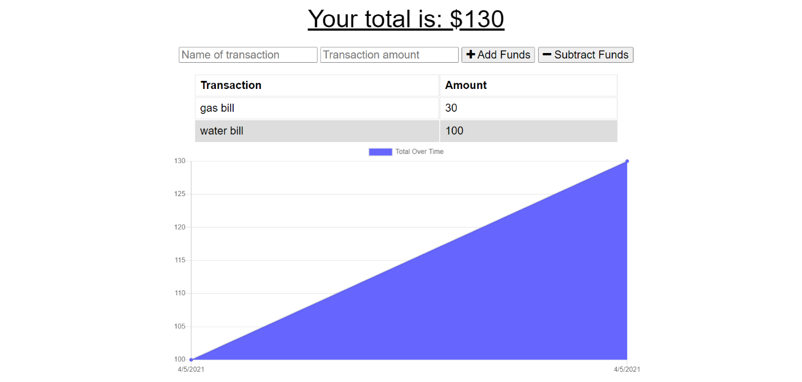

# Budget-Tracker

## Table of Contents

* [Introduction](#Introduction)
* [Installation](#Installation)
* [License](#License)
* [Screenshot](#Screenshot)
* [Link](#Link)

## Introduction

The user will be able to add expenses and deposits to their budget with or without a connection. When entering transactions offline, they should populate the total when brought back online.

Offline Functionality:

- Enter deposits offline
- Enter expenses offline

When brought back online:

- Offline entries should be added to tracker.
## Installation

* node js 
* Visual Studio Code 1.51.1
* express
* express handlebars
* MongoDB

## License

## Screenshot

## Link

* Link: https://stormy-refuge-95710.herokuapp.com/?id=606272ae0760a9001569cb59

